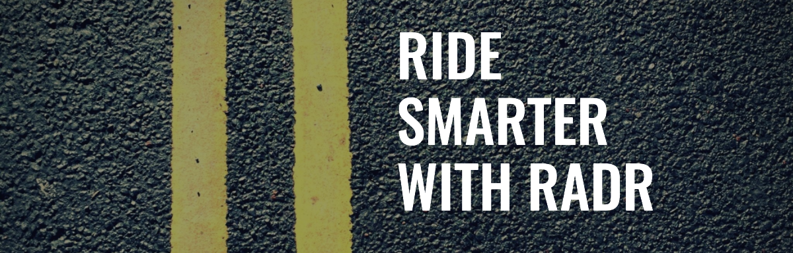
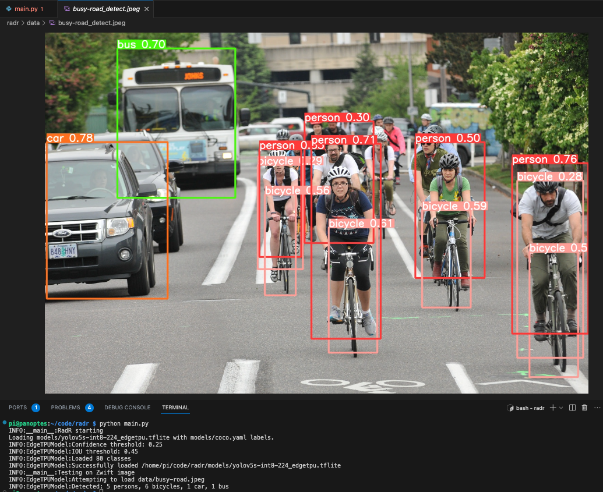

# Radr



An smart rear facing radar for your bike. Instead of using mmWave radar tech, this project uses an inexpensive raspberry pi zero 2, a camera and Coral.ai TPU accelerator to detect objects behind you.

## MVP features:
- Detect cars, cyclist (person + bicycle) and people behind you.
    - Use the Coral.ai TPU accelerator to run the model, hopefully at ~ 25 FPS.
    - Track multiple objects at once with something like DeepSORT.
        - Get distance and speed of objects.
- Implement the radar BLE Gatt service to send alerts to a cycling computer.
- 3D print a case for the pi zero 2, camera, TPU accelerator and battery that slips in under the saddle.

## Future features:
- Add neopixel LEDs controllable via BLE Gatt service.
- brighten LEDs when an object is detected.
- Add ability to record video of the ride.
- periodically save images + detection while riding and upload to cloud
- Use the cloud to train a custom model on the images. Using something like v7Labs, roboflow or ClearML.
- Have Models be versioned and deployed to the device via wifi when device is charging.

## Usage
1. Build the container:
```bash
cd radr && sudo docker build -t radr-v1 .
```
2. Run the container:
```bash
sudo docker run --rm -it --privileged radr-v1
```
The `--privileged` flag is required to access the camera and USB accelerator.

Example of the current model output:


